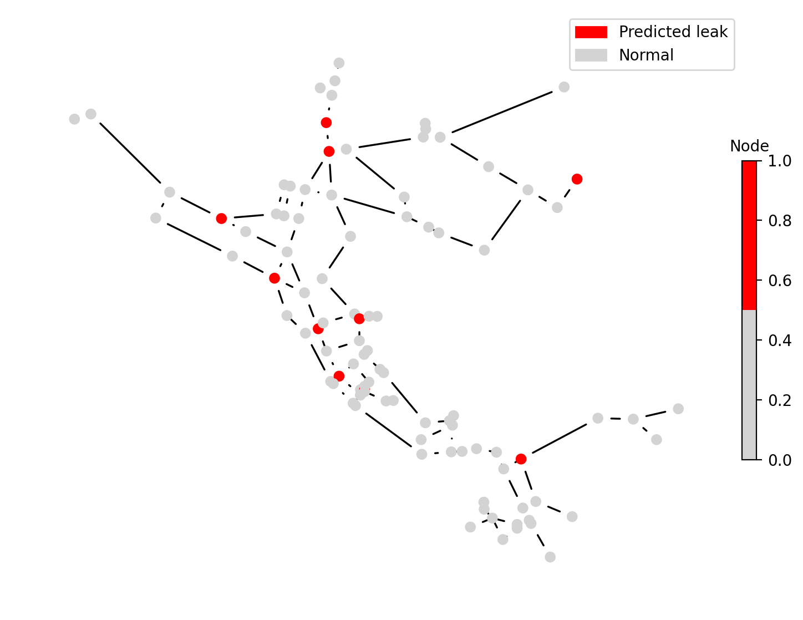

# HydraAI: Water Network Leak Prediction using Random Forest

## Project Overview

HydraAI is a web application that predicts water leaks before they occur using machine learning and synthetic data. By analyzing features derived from simulated water network data, the app identifies nodes that are likely to experience leaks, allowing water facility managers to proactively inspect and maintain infrastructure.

**Motivation:** Millions of gallons of water are lost every year due to aging infrastructure and undetected leaks. Traditional leak detection methods identify issues only after they occur. HydraAI introduces predictive leak detection, giving utilities the ability to prevent leaks before they happen. This is particularly important in regions with scarce water resources, such as the UAE, but the methodology can be applied globally.

**Scope / Current Limitations:**
- The current version predicts leaks at nodes only, not along pipes, due to naming complexity in the Net3 network model used.
- Synthetic data was used for training as real utility data is not publicly available.

---

## Table of Contents
- [Installation](#installation)
- [Dataset / Features](#dataset--features)
- [Model Training / Methodology](#model-training--methodology)
- [How to Run / Demo](#how-to-run--demo)
- [Results / Evaluation](#results--evaluation)
- [Notes / Limitations](#notes--limitations)
- [Credits / References](#credits--references)

---

## Installation

**Dependencies:**
- Python libraries: `pandas`, `numpy`, `matplotlib`, `scikit-learn`, `joblib`, `streamlit`, `wntr`

**Python version:** Use Python 3.10 or newer

**Installation:**
```bash
# Install dependencies from requirements.txt
pip install -r requirements.txt
```


---

## Features

HydraAI uses synthetic features based on the Net3 water network model. Raw training data is not included for privacy and simplicity, but the app uses these features to make predictions.

Features used in training which are the columns of hte features.csv file are"
- node: Node identifier
- rolling_mean: Mean pressure over past 4 hours
- rolling_std: Standard deviation of pressure over past 4 hours
- elevation: Elevation of node
- degree: Number of connections to other nodes
- pipe_length_avg: Average length of connected pipes
- pipe_length_max: Maximum length of connected pipes
- pipe_diameter_avg: Average diameter of connected pipes
- pipe_diameter_max: Maximum diameter of connected pipes
- pipe_avg_age: Average age of connected pipes

The raw CSV containing all simulated netwrok data is not included here for simplicity. However, a features.csv file is proviided to test the app and explore the fucnitonality without access to the full dataset.

Rolling statistics such as rolling_mean and rolling_std summarize the recent history of node pressures to capture short-term trends and temporal patterns. These are critical for the model to detect potential anomalies that could indicate future leaks. Static features, like node elevation, degree, and pipe characteristics, describe the network’s topology and infrastructure.

Currently, the app performs node-level leak predictions only, not pipe-level predictions, due to the complexity of pipe naming in the Net3 network model.


---

## Model Training/Methodology

Model Used: Random Forest Classifier (sklearn)

Random forest is an ensemble of decision trees that vote on the predicted outcome. It was used in this project becasue it is robust to noisy data, handles non-linear relationships well and is easy to interpret.

Hyperparameters:

```bash
rf_params = {
    "n_estimators": 200,          # Number of trees in the forest
    "max_depth": 10,              # Maximum depth of each tree
    "min_samples_split": 10,      # Minimum samples to split a node
    "min_samples_leaf": 5,        # Minimum samples at a leaf node
    "max_features": "sqrt",       # Features considered at each split
    "class_weight": "balanced",   # Handle class imbalance
    "random_state": 13,           # Reproducibility
    "n_jobs": -1                  # Use all CPU cores
}
```

**Training procedure
1. First, the dataset was split into training and testing sets (70%/30%)
2. Features(x) and target(y) were separated
3. Rows with missing target values dropped
4. Model trained on training data and evaluated on test set

**Evaluation metrics used:
1. Precision, Recall, F1-score, ROC-AUC
2. Confusion matrix and classification report

The trained model is saved as rf_model.pkl and can be used to predict new input data without retraining.

---

## How to Run/Demo

Streamlit app
1. Clone the repository
2. Run the app locally
3. Upload the CSV file with new node features (features.csv or sample_features.csv)
4. Outputs produced:
       Predicted leaks for each node (predicted_leak)
       Aggregated leak status per node
       Network visualization with leak nodes highlighted

---

## Results/Evaluation

Below are the model performance metrics from training:
- Training Accuracy: 0.8724
- Testing Accuracy: 0.8736 
- Precision: 0.1920
- Recall: 0.9558
- F1-score: 0.3198
- ROC-AUC: 0.9418


Feature importances indicate which factors most influence leak predictions.

Streamlit app outputs allow exploration of predicted leaks and their locations by producing an image of the network with the leaks flagged in red.



This gives a clear view of which nodes are likely to leak. And this allows managers at water facilities to quickly assess risk areas.


---

## Limitations

- Original training data is not included for privacy.
- Current predictions are node-level only, not pipe-level.
- Assumptions:
    - Prediction threshold = 0.5
    - Class imbalance handled via balanced weighting in Random Forest
- Future improvements:
    - Extend predictions to pipes
    - Integrate real utility data
    - Include more advanced visualization
    - NLP suggestions for leak causes
 
---

## References

Libraries used:

- pandas, numpy, matplotlib, scikit-learn, joblib, streamlit, wntr

Data / Network:

- Net3 sample water network from WNTR library, modified for synthetic leak simulations

References:

- WNTR Python library: https://github.com/USEPA/WNTR
- Scikit-learn Random Forest documentation

